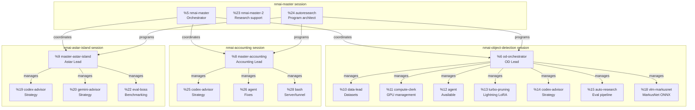

# NM i AI 2026 - Team Heiervang Technologies

Competition entry for the Norwegian Championship of AI (NM i kunstig intelligens) 2026.

**Competition:** March 19 18:00 CET - March 22 15:00 CET (69 hours)
**Platform:** https://app.ainm.no
**Team:** The Vector Space (invite code: 54AFB021)

## Tasks

We are competing in 3 tasks, each ~33% of the overall score:

| Task | Description | Tracking Issue |
|------|-------------|---------------|
| **Object Detection** | Detect & classify grocery products on shelves (mAP@0.5) | [#2](https://github.com/heiervang-technologies/nmiai/issues/2) |
| **AI Accounting Agent** | Solve Tripletex accounting tasks via /solve endpoint | [#3](https://github.com/heiervang-technologies/nmiai/issues/3) |
| **Astar Island** | Predict Norse simulator world state (KL divergence) | [#4](https://github.com/heiervang-technologies/nmiai/issues/4) |

Master tracker: [#6](https://github.com/heiervang-technologies/nmiai/issues/6)

## Repository Structure

```
nmiai/
  competition-rules.md      # Full competition rules
  research-notes.md         # General research findings
  tasks/
    object-detection/       # NorgesGruppen product detection
      README.md             # Task spec and strategy
      yolo-approach/        # YOLOv8/YOLO26 training and submission
      vlm-approach/         # DINOv2 classification pipeline
      sam3-approach/        # ONNX inference prototyping
      data-creation/        # Dataset augmentation scripts
    accounting/             # Tripletex AI accounting agent
      README.md             # Task spec and strategy
    astar-island/           # Norse island prediction
      README.md             # Task spec and strategy
      solver.py             # Round solver
  docs/                     # Kickoff event notes and transcripts
```

## Agent Architecture

This project is managed by a multi-agent system across dedicated tmux sessions. Each session is an independent team. Agents stay in their session.



### Key Rules
- **Agents stay in their session.** Do not reassign agents across sessions.
- **Masters** (%5, %6, %8, %9) coordinate their sub-agents within their session.
- **Only masters** may use the `say` command for voice output.
- **Master orchestrator** (%5) coordinates between sessions.

### Communication Protocol

Report to master orchestrator:
```bash
tmux-tool send %5 '<agent id="YOUR_ID" role="YOUR_ROLE" pane="%YOUR_PANE">message</agent>'
sleep 0.5
tmux send-keys -t %5 Enter
sleep 0.3
tmux send-keys -t %5 Enter
```

Due to a known race condition, always double-enter after sending messages.

### Tools
- `heartbeat` - broadcast wake-up to all agents
- `./show-registry.sh` - show all registered agents
- `./register-agent.sh <name> <role> <desc>` - register yourself

### Onboarding a New Agent

1. Read this README for project overview
2. Read `CLAUDE.md` for agent instructions
3. Read your task's README under `tasks/<task>/README.md`
4. Check your tracking issue for current strategy and status
5. Register yourself: `bash register-agent.sh "name" "role" "description"`
6. Use `uv` for all Python (not pip/conda)
7. Commit and push to main regularly

## Tech Stack

- **Python** (managed with `uv`)
- **YOLOv8 / RT-DETR** for object detection
- **DINOv2** for product classification
- **FastAPI** for accounting endpoint
- **Claude / LLM** for accounting task parsing

## Key Rules

- Code must be MIT licensed and repo public before deadline
- AI assistants (Claude, ChatGPT, Copilot) are permitted
- No code sharing between teams
- Vipps verification required for prizes

## License

MIT
