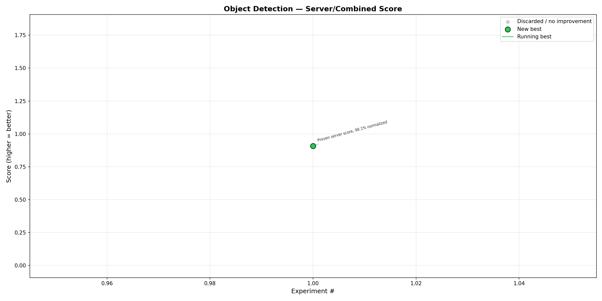
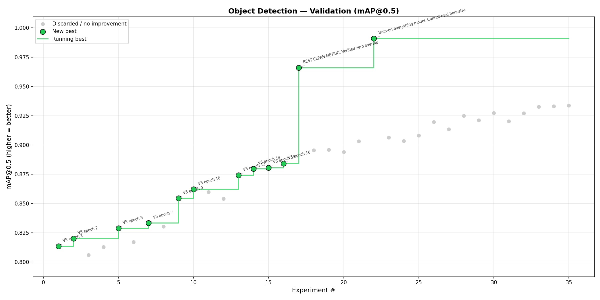
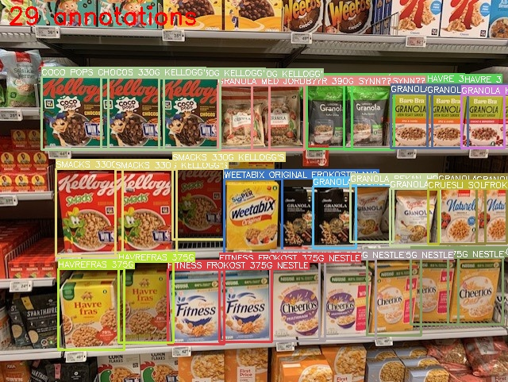

# NM i AI 2026 — Object Detection Task (NorgesGruppen Data)

## Task Overview

**Objective:** Detect and classify products on grocery store shelves.

**Scoring:** Composite mAP@0.5
- **70% weight: Detection mAP** — did you find the products? (localization)
- **30% weight: Classification mAP** — did you identify the right product? (category)
- IoU threshold: 0.5
- Detection-only submissions (all category_id=0) cap at 70% maximum score.

**Dashboard:** https://app.ainm.no/submit/norgesgruppen-data

## Autoresearch Progress

### Competition Score


### Validation (mAP@0.5)


Regenerate: `python tools/plot_autoresearch.py object-detection`

## Example Task Data

Shelf image with ground truth annotations (bounding boxes + product category labels):



*Cereal aisle — 29 annotated products. Each bounding box is labeled with the specific Norwegian SKU name (e.g., "COCO POPS CHOCOS 330G KELLOGGS"). The model must both locate products (detection) and identify the exact SKU (classification) across 356 categories.*

Key observations from the training data:
- Dense shelves with 14–235 products per image
- Norwegian product names as category labels (specific SKUs, not general categories)
- Image resolution varies widely: 481px to 5712px
- Multiple store chains: SPAR, Meny, Kiwi, etc.
- 356 categories, heavily imbalanced (1–422 annotations per category)

## Sponsor Context (from Kickoff Presentation)

**NorgesGruppen** is Norway's largest grocery retailer:
- ~50,000 employees across 2,100 stores nationwide
- 8.3 million customers per week
- 1 million order lines per day leaving warehouses
- Sustainable production with electric trucks, sea drones, own energy production

**AI Lab focus areas** (presented by Tom Daniel Sivertsen):
- Computer vision in self-checkout kiosks (active production use)
- Planogram compliance: verifying shelf layouts match plans
- Demand forecasting with classical ML
- Food waste reduction (50%+ reduction since 2015, targeting more)
- Autonomous transport and robotics

**Why this task exists:** This directly maps to NorgesGruppen's planogram compliance problem. Tom Daniel emphasized: "AI is not just what happens on a computer screen -- it's also in the physical value chain." They are actively digitizing the physical retail environment with cameras to optimize operations. Detecting products on shelves, identifying misplaced items, and spotting empty shelves is real production work at NorgesGruppen.

**Kickoff presentation note:** Erik specifically mentioned that classification is critical but not immediately obvious from the task video -- you must not only draw bounding boxes but also correctly identify which product is in each box. The dataset is described as "quite small" and "will require a lot from people." Google Cloud GPUs are available to level the playing field.

**Real-world impact:** NorgesGruppen aims for climate-neutral operations by 2030 and wants AI to help with frictionless shopping, keeping rural stores open (possibly unmanned), and eliminating food waste.

---

## Competition Constraints

| Constraint | Value |
|---|---|
| Deadline | March 22, 2026 at 15:00 CET |
| Submissions per day | 10 (resets midnight UTC) |
| Max in-flight | 2 |
| Max ZIP size | 420 MB (5 GB total submission) |
| Inference timeout | 300 seconds |
| GPU | NVIDIA L4 (24 GB VRAM) |
| Network access | None (sandboxed) |
| Infrastructure errors | Up to 2 don't count against limit |

---

## Training Data

### COCO Dataset (`NM_NGD_coco_dataset.zip`, 864 MB)
- 248 shelf images with COCO annotations
- ~22,700 bounding boxes
- 356 product categories (category_id 0–355)

### Product Reference Images (`NM_NGD_product_images.zip`, 60 MB)
- 327 products with multi-angle photos
- Organized by barcode: `{product_code}/main.jpg`, etc.
- **Note:** 327 products < 356 categories — some categories may lack reference images

---

## Submission Format

### ZIP Structure
```
submission.zip
├── run.py          # MUST be at root, not in subfolder
├── model.pt        # Model weights
├── config.yaml     # (optional) model config
└── utils/          # (optional) helper modules
```

### run.py Contract
```bash
python run.py --input /data/images/ --output /predictions.json
```
- **Args:** `--input` (NOT `--data`!) and `--output`
- **Input:** JPEG images at `/data/images/` (format: `img_XXXXX.jpg`)
- **Output:** Flat JSON array at specified path

### Output JSON Format — FLAT COCO-STYLE
```json
[
  {"image_id": "img_00042.jpg", "bbox": [x, y, w, h], "category_id": 42, "score": 0.95},
  {"image_id": "img_00042.jpg", "bbox": [x2, y2, w2, h2], "category_id": 5, "score": 0.87}
]
```
- Each detection is its own entry — **NOT nested under "predictions"**
- `bbox`: COCO format [x_min, y_min, width, height]
- `category_id`: integer 0–355
- `score`: float 0.0–1.0 (**NOT "confidence"**)

---

## Sandbox Environment

### Pre-installed Libraries
- PyTorch 2.6.0+cu124
- torchvision 0.21.0+cu124
- **ultralytics 8.1.0** (YOLOv8 native support)
- onnxruntime-gpu 1.20.0
- opencv-python-headless 4.9.0.80
- albumentations
- Pillow, numpy, scipy, scikit-learn
- pycocotools
- **timm** (PyTorch Image Models)
- **supervision** (Roboflow)
- safetensors

### Model Compatibility
| Model | Native Support | ONNX Required |
|---|---|---|
| YOLOv8 | Yes (ultralytics) | No |
| YOLOv5 | Yes | No |
| YOLOv9/10/11 | No | Yes |
| Detectron2 | No | Yes |
| MMDetection | No | Yes |
| ONNX models | Yes | N/A |

### Security Restrictions (BLOCKED)
- `os`, `subprocess`, `socket`, `ctypes` imports
- `eval()`, `exec()`, `compile()`, `__import__()`
- ELF binaries, symlinks, path traversal
- **Use `pathlib` for file operations**

### GPU Access
```python
import torch
assert torch.cuda.is_available()  # True in sandbox
device = torch.device('cuda')
```

---

## Strategy Analysis

### Key Insight: 70/30 Scoring Split
The scoring heavily favors **detection** (70%) over **classification** (30%). This means:
1. **Priority 1:** Maximize detection recall — find every product on the shelf
2. **Priority 2:** Get classification right where possible
3. A detection-only model (category_id=0 for all) could score up to 70%

### Challenge Analysis
- **248 training images** for **356 categories** is extremely limited
- Average ~64 annotations per image (dense shelf scenes)
- Average ~63 annotations per category (very few-shot for many classes)
- 327 reference products with multi-angle photos available as supplementary data

### Recommended Approach: Two-Stage Pipeline

#### Stage 1: Detection (70% of score)
**Primary: Fine-tuned YOLOv8x or YOLOv8l on shelf data**
- YOLOv8 is natively supported (ultralytics 8.1.0)
- Fine-tune on the 248 images treating all products as a single "product" class
- This maximizes detection recall without worrying about 356 classes
- Use aggressive data augmentation: mosaic, mixup, copy-paste, random crop

**Alternative: Co-DETR or RT-DETR via ONNX**
- Transformer-based detectors may handle dense scenes better
- But requires ONNX export and may be slower

#### Stage 2: Classification (30% of score)
**Approach A: Feature Matching with Reference Images**
- Use `timm` to extract embeddings (e.g., ConvNeXt, EfficientNet, DINOv2 if fits)
- Pre-compute embeddings for all 327 reference product images
- For each detected box, crop, embed, and find nearest neighbor
- Pro: Leverages the reference images directly, no training needed for classification
- Con: 29 categories lack reference images

**Approach B: Classification Head on COCO Training Data**
- Train a classifier on crops from the 22.7k annotations
- May overfit with only ~63 examples per category on average

**Approach C: Hybrid**
- Train classifier on COCO crops
- Fall back to reference image matching for low-confidence predictions

### Inference Time Budget (300s)
- Image loading + preprocessing: ~10s
- Detection (YOLOv8l, 248 test images est.): ~30–60s
- Crop extraction: ~5s
- Classification (embedding + matching): ~30–60s
- JSON output: ~1s
- **Total: ~80–130s — well within 300s budget**

### Model Size Budget (420MB)
- YOLOv8l weights: ~87 MB
- YOLOv8x weights: ~131 MB
- Classification model (EfficientNet-B3): ~48 MB
- Reference embeddings: ~5 MB
- Code + config: ~1 MB
- **Total: ~140–185 MB — well within 420MB limit**

### Data Augmentation Strategy (for training)
Since we only have 248 images:
- **Mosaic augmentation** (combine 4 images)
- **Copy-paste augmentation** (paste product crops onto different shelf backgrounds)
- **Random crop/resize** at multiple scales
- **Color jitter** (shelf lighting varies)
- **Horizontal flip** (shelves are symmetric)
- Use albumentations (pre-installed) for augmentation pipeline

### mAP@0.5 Optimization Tips
- **Lower confidence threshold** (0.001–0.01) to maximize recall
- **Tune NMS IoU threshold** — for dense shelves, use lower NMS IoU (0.3–0.5)
- **Test-Time Augmentation (TTA):** multi-scale inference, horizontal flip
- **Weighted Boxes Fusion (WBF)** instead of NMS for ensemble approaches
- **FP16 inference** on L4 GPU for speed (no accuracy loss at IoU 0.5)

---

## Implementation Plan

### Phase 1: Baseline Detection-Only (Target: 50–60% score)
1. Download and explore COCO dataset
2. Train YOLOv8l/x as single-class detector ("product")
3. Submit with all category_id=0
4. Validate pipeline works end-to-end

### Phase 2: Add Classification (Target: 70–80% score)
1. Build reference image embedding index using timm
2. Train crop classifier on COCO annotations
3. Two-stage pipeline: detect → crop → classify
4. Tune confidence thresholds

### Phase 3: Optimize (Target: 85%+ score)
1. Multi-class YOLOv8 training (356 classes directly)
2. Ensemble detection + classification approaches
3. TTA and WBF
4. Tune NMS and confidence thresholds on validation split
5. FP16 quantization for speed

### Phase 4: Advanced (if time permits)
1. Co-DETR or DINO-based detection via ONNX
2. Pseudo-labeling with high-confidence predictions
3. Synthetic data generation from reference images
4. Tile-based inference for high-resolution shelf images

---

## File Structure Plan
```
~/ht/nmiai/tasks/object-detection/
├── README.md              # This file
├── data/
│   ├── coco/              # Extracted COCO dataset
│   └── products/          # Extracted reference images
├── train/
│   ├── train_detector.py  # YOLOv8 training script
│   ├── train_classifier.py # Classification training
│   └── augmentation.py    # Data augmentation pipeline
├── inference/
│   ├── run.py             # Main inference script (for submission)
│   ├── detector.py        # Detection module
│   └── classifier.py      # Classification module
├── weights/               # Trained model weights
├── notebooks/             # Exploration notebooks
└── submission/            # Final zip contents
```

---

## GPU Resources

### Local (centurion)
- **Host:** centurion (192.168.8.170, port 2405)
- **GPU:** 1x NVIDIA RTX 3090 (24GB)
- **Use for:** YOLO training, quick experiments
- **Access:** `ssh centurion`

### Remote (titan)
- **Host:** titan (192.168.8.158)
- **GPU:** 2x NVIDIA RTX 3090 (24GB each)
- **Use for:** DINOv2 training, linear probe, heavy experiments
- **Access:** `ssh me@192.168.8.158`
- **Note:** Also runs llama-server and unsloth studio — check `nvidia-smi` before launching

---

## Important Rules Reminders
- Code must be open-sourced (MIT license) before deadline for prize eligibility
- No network access during inference
- No blocked imports (os, subprocess, socket, ctypes, eval, exec)
- Use pathlib for file operations
- All common AI/ML tools and coding assistants are explicitly allowed
